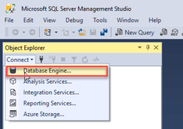
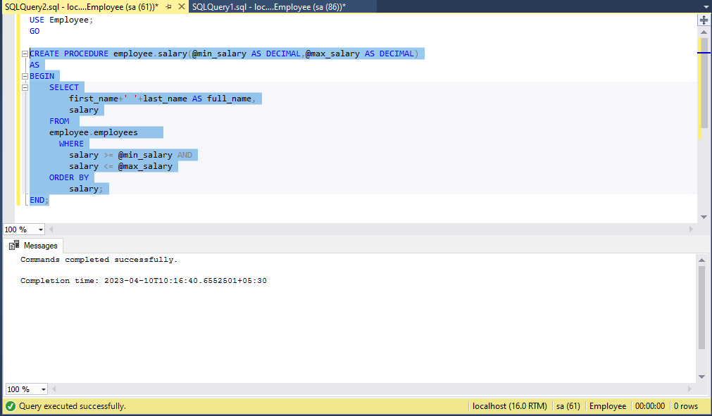
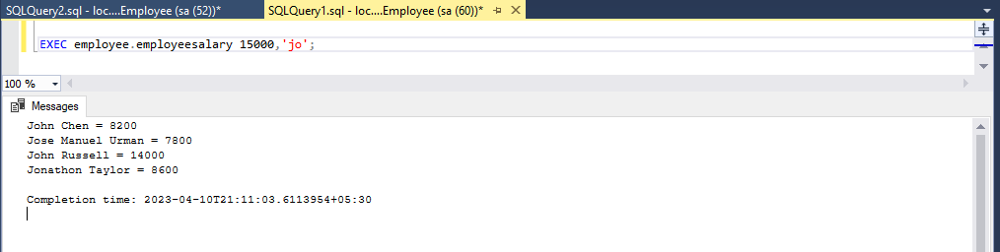

# SQL-Server


## Introduction to SQLServer

* [**What is Database**](#what-is-database) <!-- style="font-size:20px" -->
* [**What is SQL Server**](#what-is-sql-server) <!-- style="font-size:20px" -->
* [**Installation of SQL Server**](#installation-of-sql-server) <!-- style="font-size:20px" -->

### What is Database

> A database is a systematic collection of data. They support electronic storage and manipulation of data. Databases make data management easy.

{{1-2}}
> **Types of Databases**
> <br>
> <hr>
> <li> [Centralized Database](#centralized-database) </li> 
> <li> [Distributed Databse](#distributed-databse) </li>
> <li> [NoSql Database](#nosql-database) </li>
> <li> [Cloud Database](#cloud-database) </li>
> <li> [Relational Database](#relational-database) </li>
> <li> [Network Database](#network-database) </li>
> <li> [Object-Oriented Database](#object-oriented-database) </li>
> <li> [Hierarchical Database](#hierarchical-database) </li>

#### Centralized Database

> A centralized database is stored at a single location such as a mainframe computer. It is maintained and modified from that location only and usually accessed using an internet connection such as a LAN or WAN. The centralized database is used by organisations such as colleges, companies, banks etc.


#### Distributed Databse

> A distributed database is basically a database that is not limited to one system, it is spread over different sites, i.e, on multiple computers or over a network of computers.


#### NoSql Database

> NoSQL Database is a non-relational Data Management System, that does not require a fixed schema.


#### Cloud Database

> A cloud database is a database service built and accessed through a cloud platform. It serves many of the same functions as a traditional database with the added flexibility of cloud computing.


#### Relational Database

> A relational database organizes data into rows and columns, which collectively form a table. Data is typically structured across multiple tables, which can be joined together via a primary key or a foreign key.


#### Network Database

> A network database is a type of database model wherein multiple member records or files can be linked to multiple owner files and vice versa.


#### Object-Oriented Database

> object-oriented database management system is the data model in which data is stored in form of objects, which are instances of classes. These classes and objects together make an object-oriented data model.


#### Hierarchical Database

> A hierarchical model represents the data in a tree-like structure in which there is a single parent for each record.


### What is SQL Server

SQL Server is a relational database management system, or RDBMS, developed and marketed by Microsoft.

Similar to other RDBMS software, SQL Server is built on top of SQL, a standard programming language for interacting with relational databases. SQL Server is tied to Transact-SQL, or T-SQL, the Microsoft’s implementation of SQL that adds a set of proprietary programming constructs.

**SQL Server Architecture** 


SQL Server consists of two main components:

* Database Engine
* SQLOS

**Database Engine**


The core component of the SQL Server is the Database Engine. 

The Database Engine consists of a relational engine that processes queries and a storage engine that manages database files, pages, indexes, etc. The database objects such as stored procedures, views, and triggers are also created and executed by the Database Engine.

**SQLOS**(SQL Server Operating System)

SQLOS provides many operating system services such as memory and I/O management. Other services include exception handling and synchronization services.

### Installation of SQL Server
<br>

* [**Normal Installation**](#normal-installation) 
* [**Docker SQL Server Installation**](#docker-sql-server-installation)

#### Normal Installation 

* [**Download SQL-Server**](#download-sql-server)
* [**Install SQL-Server**](#install-sql-server)
* [**Install SQL-Server Management Studio**](#install-sql-server-management-studio)
* [**Connect to SQL-Server**](#connect-to-sql-server)

##### Download SQL-Server

{{1-4}}
> **Step 1:** Go to the official page through this URL: https://www.microsoft.com/en-in/sql-server/sql-server-downloads.

{{2-4}}
> **Step 2:** Sekect the Developer version ,Click on the "Download now" button. Immediately the SQL Server setup starts downloading on our system.
> 

{{3-4}}
> **Step 3:** Once the file has been downloaded, we will get the setup named "SQL2022-SSEI-DEV.exe."
> 

##### Install SQL-server

{{1-15}}
> **Step 1:** Double click on "SQL2022-SSEI-DEV.exe" setup file. We will get the below screen with three options: Basic, Custom, and Download Media files. Here, we will select the 'Basic' option to install the basic version that includes all of the default configurations needed to learn Microsoft SQL Server.
> 

{{2-15}}
> **Step 2:** Next, the installer will ask where to save the download. Once selected press Install.
> <br>
> 

{{3-15}}
> **Step 3:** This will download and run the install package.
> 

{{4-15}}
> **Step 4:** The SQL Server Installation Center will open after the download completes and on the Installation page, we have the following install options:
> 
> We will pick "New SQL Server stand-alone installation or add features to an existing installation".

{{5-15}}
> **Step 5:** On the next screen, you can enter a product key or use a free edition. The free evaluation edition is good for 180 days, which is what we will use.
> 

{{6-15}}
> **Step 6:** Read the license terms to make sure that you agree and press Next.
> 

{{7-15}}
> **Step 7:** The Microsoft Update can check if there are updates. You can enable this option and Microsoft Update will check for updates. Press Next to continue.
> 

{{8-15}}
> **Step 8:** The install rules window verifies possible problems during the installation.
> 

{{9-15}}
> **Step 9:** Feature Selection, Select Database Engine Service
> 

{{10-15}}
> **Step 10:** In the instance configuration, we enter a name to be used for the SQL Server instance.
> 

{{11-15}}
> **Step 11:** The server configuration allows creating or adding service accounts for the different services used by SQL Server. You can use the defaults or create new accounts with custom security and passwords to run the services.
> 

{{12-15}}
> **Step 12:** The database engine configuration allows you to configure several parts of the installation.
> 

{{13-15}}
> **Step 13:** Once everything is configured, you can check the configuration and press the Install button to continue.
> 

{{14-15}}
> **Step 14:** If everything is successful, MS SQL Server 2022 will be installed, and the relational database management system is ready for use.
> 

##### Install SQL-Server Management Studio

{{1-5}}
> **Step 1:** Click to download sql server management studio from below link
> <br>
> https://learn.microsoft.com/en-us/sql/ssms/download-sql-server-management-studio-ssms?view=sql-server-ver16
> <br>
> double-click the installation file SSMS-Setup-ENU.exe to launch the SSM installer. The installation process of SMSS is straightforward. you need to follow the screen sequence.

{{2-5}}
> **Step 2:** Click the Install button
> 

{{3-5}}
> **Step 3:** Wait for a few minutes while the installer sets up the software:
> 

{{4-5}}
> **Step 4:** Once setup is completed, click the Close button:
> 
> Now, you should have SQL Server 2022  and SQL Server Management Studio installed on your computer.

##### Connect to SQL Server

{{1-5}}
> **Step 1:** First, launch the Microsoft SQL Server Management Studio from the Start menu:
> 

{{2-5}}
> **Step 2:** Next, from the Connect menu under the Object Explorer, choose the Database Engine…
> 

{{3-5}}
> **Step 3:** Then, enter the information for the Server name (localhost), Authentication (SQL Server Authentication), and password for the  sa user and click the Connect button to connect to the SQL Server. Note that you should use the sa user and password that you entered during the installation.
> 

{{4-5}}
> **Step 4:** if the connection is established successfully, then you will see the following Object Explorer panel:
> 

#### Docker SQL Server Installation

{{1-6}}
> **Step 1:** Install Docker to the system click on below link to download and then install .
> <br>
> https://docs.docker.com/desktop/install/windows-install/

{{2-6}}
>  **Step 2:** Now that you’ve installed Docker, you can open up the terminal and supply the following command to check if Docker has been successfully installed on your device:
> <br>
>  <p style="padding: 10px; border: 2px solid black; background-color:white;"> docker -v </p>
> <br>
> 

{{3-6}}
> **Step 3:** As you can see from the figure above, Docker has been installed successfully and you can see the installed version as well. With Docker up and running, the next step is to pull the official SQL Server Docker image from Docker Hub and get down to brass tacks.
> <br>
> Next, you will be creating a directory for this exercise and opening the terminal in that directory. Once in the directory, run the command given below to pull the docker image from the repository to your local device:
> <br>
>  <p style="padding: 10px; border: 2px solid black; background-color:white;"> docker pull mcr.microsoft.com/mssql/server </p>
> <br>
> 

{{4-6}}
> **Step 4:** Once the SQL Server Docker Image has been pulled and extracted, you need to start the SQL Server Docker Container for this image. A Container in Docker is a running instance of the Docker image that can be started by performing the command as follows:
> <br>
> <p style="padding: 10px; border: 2px solid black; background-color:white;"> docker run -e "ACCEPT_EULA=Y" -e "MSSQL_SA_PASSWORD=<YourStrong@Passw0rd>" -p 1433:1433 --name sql1 --hostname sql1 -d mcr.microsoft.com/mssql/server:2022-latest </p>
> <br>
> 

{{5-6}}
> **Step 5:** As visible from the figure above, on running the command as mentioned in the previous step, an ID is returned. This is the unique ID of the SQL Server Docker Container that is currently running the SQL Server Instance. You can also verify the containers that currently running by leveraging the command as follows:
> <br>
> <p style="padding: 10px; border: 2px solid black; background-color:white;"> docker container ls </p>
> <br>
> 

## Data Objects 

A database object is any defined object in a database that is used to store or reference data.Anything which we make from create command is known as Database Object.It can be used to hold and manipulate the data.Some of the examples of database objects are : view, sequence, indexes, etc.

<br>

| **_Object_**          | **_Description_**                                                         |
|-----------------------|---------------------------------------------------------------------------|
|     Table             |     Basic   unit of storage composed     of rows and columns              |
|     View              |     Logically   represents subsets of     data from one or more tables    |
|     Sequence Index    |     Numeric value generator                                               |
|     Index             |     Improves   the performance of     some queries                        |
|     Synonym           |     Gives   alternative names to     objects                              |
| Schema                | collection of database objects associated with a database                 |

## Data Types

A Data Type in SQL server is defined as the type of data that any column or variable can store. It is a type of data that an object holds like integer, character, string, etc.

The Different types of datatypes are :

* [**Exact Numeric**](#exact-numeric)
* [**Approximate Numeric**](#approximate-numeric)
* [**Date & Time**](#date-and-time)
* [**Character Strings**](#character-strings)
* [**Unicode Character Strings**](#unicode-character-strings)
* [**Binary Strings**](#binary-strings)
* [**Other DataTypes**](#other-data-type)

### Exact Numeric 
<br>

<!-- data-transpose data-type="none" -->
| **_Data Type_** | **_Description_**                          | **_Lower limit_**                   | **_Upper limit_**                    | **_Memory_**       |
|-----------------|--------------------------------------------|-------------------------------------|--------------------------------------|--------------------|
| bigint          | It stores whole numbers in the range given | −2^63 (−9,223,372, 036,854,775,808) | 2^63−1 (−9,223,372, 036,854,775,807) | 8 bytes            |
| int             | It stores whole numbers in the range given | −2^31 (−2,147, 483,648)             | 2^31−1 (−2,147, 483,647)             | 4 bytes            |
| smallint        | It stores whole numbers in the range given | −2^15 (−32,767)                     | 2^15 (−32,768)                       | 2 bytes            |
| tinyint         | It stores whole numbers in the range given | 0                                   | 255                                  | 1 byte             |
| bit             | It can take 0, 1, or NULL values.          | 0                                   | 1                                    | 1 byte/8bit column |
| decimal         | Used for scale and fixed precision numbers | −10^38+1                            | 10^381−1                             | 5 to 17 bytes      |
| numeric         | Used for scale and fixed precision numbers | −10^38+1                            | 10^381−1                             | 5 to 17 bytes      |
| money           | Used monetary data                         | −922,337, 203, 685,477.5808         | +922,337, 203, 685,477.5807          | 8 bytes            |
| smallmoney      | Used monetary data                         | −214,478.3648                       | +214,478.3647                        | 4 bytes            |

### Approximate Numeric
 <br>

<!-- data-transpose data-type="none" -->
| **_Data Type_** | **_Description_**                      | **_Lower limit_** | **_Upper limit_** | **_Memory_**                | **_Precision_** |
|---------------|--------------------------------------|-----------------|-----------------|---------------------------|---------------|
| float(n)      | Used for a floating precision number | −1.79E+308      | 1.79E+308       | Depends on the value of n | 7 Digit       |
| real          | Used for a floating precision number | −3.40E+38       | 3.40E+38        | 4 bytes                   | 15 Digit      |

### Date and Time
<br>

<!-- data-transpose data-type="none" -->
| **_Data Type_**  | **_Description_**                                                                                                         | **_Storage size_** | **_Accuracy_**                              | **_Lower Range_**  | **_Upper Range_**  |
|----------------|-------------------------------------------------------------------------------------------------------------------------|------------------|-------------------------------------------|------------------|------------------|
| DateTime       | Used for specifying a date and time from January 1, 1753 to December 31, 9999. It has an accuracy of 3.33 milliseconds. | 8 bytes          | Rounded to increments of .000, .003, .007 | 1753-01-01       | 9999-12-31       |
| smalldatetime  | Used for specifying a date and time from January 1, 0001 to December 31, 9999. It has an accuracy of 100 nanoseconds    | 4 bytes, fixed   | 1 minute                                  | 1900-01-01       | 2079-06-06       |
| date           | Used to store only date from January 1, 0001 to December 31, 9999                                                       | 3 bytes, fixed   | 1 day                                     | 0001-01-01       | 9999-12-31       |
| time           | Used for storing only time only values with an accuracy of 100 nanoseconds.                                             | 5 bytes          | 100 nanoseconds                           | 00:00:00.0000000 | 23:59:59.9999999 |
| datetimeoffset | Similar to datatime but has a time zone offset                                                                          | 10 bytes         | 100 nanoseconds                           | 0001-01-01       | 9999-12-31       |
| datetime2      | Used for specifying a date and time from January 1, 0001 to December 31, 9999                                           | 6 bytes          | 100 nanoseconds                           | 0001-01-01       | 9999-12-31       |

### Character Strings
<br>

<!-- data-transpose data-type="none" -->
|**_Data Type_**| **_Description_**                                                                                  |**_Lower limit_**| **_Upper limit_**   | **_Memory_**      |
|---------------|----------------------------------------------------------------------------------------------------|-----------------|---------------------|-------------------|
| char          | It is a character string with a fixed width. It stores a maximum of 8,000 characters.              | 0 chars         | 8000 chars          | n bytes           |
| varchar       | This is a character string with variable width                                                     | 0 chars         | 8000 chars          | n bytes + 2 bytes |
| varchar (max) | This is a character string with a variable width. It stores a maximum of 1,073,741,824 characters. | 0 chars         | 2^31 chars          | n bytes + 2 bytes |
| text          | This is a character string with a variable width. It stores a maximum 2GB of text data.            | 0 chars         | 2,147,483,647 chars | n bytes + 4 bytes |

### Unicode Character Strings
<br>

<!-- data-transpose data-type="none" -->
| **_Data Type_** | **_Description_**                        | **_Lower limit_** | **_Upper limit_**  | **_Memory_**              |
|-----------------|------------------------------------------|-------------------|--------------------|---------------------------|
| nchar           | It is a Unicode string of fixed width    | 0 chars           | 4000 chars         | 2 times n bytes           |
| nvarchar        | It is a unicode string of variable width | 0 chars           | 4000 chars         | 2 times n bytes + 2 bytes |
| ntext           | It is a unicode string of variable width | 0 chars           | 1,073,741,823 char | 2 times the string length |

### Binary Strings
<br>

<!-- data-transpose data-type="none" -->
| **_Data Type_** | **_Description_**                                                             | **_Lower limit_** | **_Upper limit_**   | **_Memory_**                                |
|-----------------|-------------------------------------------------------------------------------|-------------------|---------------------|---------------------------------------------|
| binary          | It is a fixed width binary string. It stores a maximum of 8,000 bytes.        | 0 bytes           | 8000 bytes          | n bytes                                     |
| varbinary       | This is a binary string of variable width. It stores a maximum of 8,000 bytes | 0 bytes           | 8000 bytes          | The actual length of data entered + 2 bytes |
| image           | This is a binary string of variable width. It stores a maximum of 2GB.        | 0 bytes           | 2,147,483,647 bytes |                                             |

###  Other Data Type
<br>

<!-- data-transpose data-type="none" -->
| **_Data Type_**        | **_Description_**                                                                                            |
|------------------------|--------------------------------------------------------------------------------------------------------------|
| Cursor                 | Its output is a column of sp_cursor_list and sp_describe_cursor. It returns the name of the cursor variable. |
| Row version            | It version stamps table rows.                                                                                |
| Hierarchyid            | This datatype represents a position in the hierarchy                                                         |
| Uniqueidentifier       | Conversion from a character expression.                                                                      |
| Sql_variant            | It stores values of SQL server supported Datatypes.                                                          |
| XML                    | It stores XML data in a column.                                                                              |
| Spatial Geometry type  | It represents data in a flat coordinate system.                                                              |
| Spatial Geography type | It represents data in the round-earth coordinate system.                                                     |
| table                  | It stores a result set for later processing.                                                                 |


## Constraints

* Constraint is used to define rules to allow or restrict what values can be stored in columns. The purpose of inducing constraints is to enforce the integrity of a database.
* Constraint are used to limit the type of data that can be inserted into a table.
* Constraint can be classified into two types - column level and table level.
* The column level Constraint can apply only to one column where as table level constraints are applied to the entire table.
* Constraint is declared at the time of creating a table.

<br>

**SQL Server Constraints are :**


1. NOT NULL
2. UNIQUE
3. PRIMARY KEY
4. FOREIGN KEY
5. DEFAULT
6. CHECK

<br>

### NOT NULL

<br>

The **_NOT NULL_** constraint enforces a column to NOT accept NULL values.

This enforces a field to always contain a value, which means that you cannot insert a new record, or update a record without adding a value to this field.

<br>

NOT NULL Example

```markdown 
CREATE TABLE Persons (
    ID int NOT NULL,
    LastName varchar(255) NOT NULL,
    FirstName varchar(255) NOT NULL,
    Age int
);
```

<br>

### UNIQUE

<br>

The ***UNIQUE*** constraint ensures that all values in a column are different.

<br>

UNIQUE Constraint Example

```markdown
CREATE TABLE Persons (
    ID int NOT NULL UNIQUE,
    LastName varchar(255) NOT NULL,
    FirstName varchar(255),
    Age int
);

```

### PRIMARY KEY

<br>

The ***PRIMARY KEY*** constraint uniquely identifies each record in a table.

Primary keys must contain UNIQUE values, and cannot contain NULL values.

<br>

PRIMARY KEY Example

```markdown 
CREATE TABLE Persons (
    ID int NOT NULL,
    LastName varchar(255) NOT NULL,
    FirstName varchar(255),
    Age int,
    CONSTRAINT PK_Person PRIMARY KEY (ID,LastName)
);
```
<br>

### FOREIGN KEY

<br>

The ***FOREIGN KEY*** constraint is used to prevent actions that would destroy links between tables.

A FOREIGN KEY is a field (or collection of fields) in one table, that refers to the ***PRIMARY KEY*** in another table.


<br>

FOREIGN KEY Example

```markdown
CREATE TABLE orders (
    order_id int NOT NULL,
    product varchar(255),
    total int,
    customer_id int,
    PRIMARY KEY (order_id),
    FOREIGN KEY (customer_id) REFERENCES Persons(order_id)
);
```

### DEFAULT

<br>

The ***DEFAULT*** constraint is used to set a default value for a column.

<br>

DEFAULT Example

```markdown
CREATE TABLE Persons (
    ID int NOT NULL,
    LastName varchar(255) NOT NULL,
    FirstName varchar(255),
    Age int,
    City varchar(255) DEFAULT 'Sandnes'
);
```

### CHECK

<br>

The ***CHECK*** constraint is used to limit the value range that can be placed in a column.

If you define a ***CHECK*** constraint on a column it will allow only certain values for this column.

If you define a ***CHECK*** constraint on a table it can limit the values in certain columns based on values in other columns in the row.

<br>

CHECK Example

```markdown
CREATE TABLE Persons (
    ID int NOT NULL,
    LastName varchar(255) NOT NULL,
    FirstName varchar(255),
    Age int CHECK (Age>=18)
);
```

## Data Definition Language(DDL)

A data definition language (DDL) is a computer language used to create and modify the structure of database objects in a database. These database objects include views, schemas, tables, indexes, etc.

<br>

| **_Object_**          | **_Description_**                                                         |
|-----------------------|---------------------------------------------------------------------------|
|     Table             |     Basic   unit of storage composed     of rows and columns              |
|     View              |     Logically   represents subsets of     data from one or more tables    |
|     Sequence Index    |     Numeric value generator                                               |
|     Index             |     Improves   the performance of     some queries                        |
|     Synonym           |     Gives   alternative names to     objects                              |
| Schema                | collection of database objects associated with a database                 |

<br>

**Data Definition Laungauge Commands are as follows**

1. CREATE
2. ALTER
3. DROP
4. TRUNCATE

### Create Command

create is a DDL SQL command used to create a table ,database & Schema in relational database management system.

The table creation command requires the following details −

*	Name of the table
*	Name of the fields(Column) 
*	Definitions for each field(Datatype)

<br>

Syntax:

```markdown
    /* to create database */
    CREATE DATABASE database_name;

    /* to create schema */
    CREATE SCHEMA schema_name;

    /* to create table */
	CREATE TABLE schema_name.table_name 
	( 
		column_name1 datatype1, 
		column_name2 datatype2, 
		column_name3 datatype3, 
		column_name4 datatype4 
	);
```

<br>

Create Command Example

```markdown

    /* to create database */
    CREATE DATABASE EmployeeManagement;

    /* to create schema */
    CREATE SCHEMA employee;

    /* to create table */
    CREATE TABLE employee.regions (
	    region_id INT IDENTITY(1,1) PRIMARY KEY,
	    region_name VARCHAR (25) DEFAULT NULL
    );

    CREATE TABLE employee.countries (
	    country_id CHAR (2) PRIMARY KEY,
	    country_name VARCHAR (40) DEFAULT NULL,
	    region_id INT NOT NULL,
	    FOREIGN KEY (region_id) REFERENCES employee.regions (region_id)
    );
```

### Alter Command 

Alter statement is used to add, delete or modify columns in an exisiting table

<br>

* **Add column**

The basic syntax of an ALTER TABLE command to add a New Column in an existing table is as follows.

Syntax:

```markdown
    ALTER  TABLE table_name
    ADD column_name datatype;
```

Example:

```markdown 
    ALTER TABLE employee.employees
    ADD resigned_date DATE;
```

<br>

* **Modify column**

The basic syntax of an ALTER TABLE command to change the DATA TYPE of a column in a table is as follows.

Syntax:

```markdown
    ALTER  TABLE  table_name 
    ALTER  COLUMN column_name  datatype;
```

Example:

```markdown
    ALTER TABLE employee.employees
    ALTER COLUMN resigned_date DateTime;
```

<br>

* **Delete column**

The basic syntax of an ALTER TABLE command to DROP COLUMN in an existing table is as follows.

 Syntax:

```markdown
    ALTER  TABLE table_name 
    DROP  COLUMN column_name;
```

Example:

```markdown
    ALTER TABLE employee.employees
    DROP COLUMN resigned_date;
```

<br>

* **Adding constraints**

Example:

```markdown
    ALTER TABLE employee.employees ADD UNIQUE (email);
```

### Drop Command

It is very easy to drop an existing table, but you need to be very careful while deleting any existing table because the data lost will not be recovered after deleting a table. 

<br>

Syntax:

```markdown
    DROP DATABASE database_name;

    DROP  TABLE  table_name;
```

<br>

Example:

```markdown
    /* to drop database */
    DROP DATABASE IF EXISTS EmployeeManagement;

    /* to drop schema */
    DROP SCHEMA IF EXISTS employee;

    /* to drop table */
    DROP TABLE IF EXISTS employee.employees;
```

### Truncate Command

TRUNCATE command removes all the records from a table. But this command will not destroy the table's structure. 

<br>

Syntax:

```markdown 
    TRUNCATE TABLE table_name ;
```

<br>

Example:

```markdown
    TRUNCATE TABLE employee.employees;
```

## Data Manipulation Langauage(DML)

The DML commands in Structured Query Language change the data present in the SQL database. We can easily access, store, modify, update and delete the existing records from the database using DML commands.

<br>

| **_Object_**          | **_Description_**                                                         |
|-----------------------|---------------------------------------------------------------------------|
|     Table             |     Basic   unit of storage composed     of rows and columns              |

DML Commands are :

* Insert Command
* Update Command
* Delete Command

### Insert Command

* The SQL INSERT INTO Statement is used to add new rows of data to a table in the database.
* Only one row is inserted with this syntax.
* Insert a new row containing values for each column.
* List values in the default order of the columns in the table.
* Optionally,list the columns in the insert clause.
* Enclose character and data values within single quotation marks.

<br>

Syntax:

```markdown
INSERT INTO table_name[(column[,column…..])] VALUES (value[,value….]);

```
<br>

Example:

```markdown 
INSERT INTO employee.regions(region_id,region_name) VALUES (1,'Europe');
```

<br>

**Methods of inserting null values:**

* Implict:  Omit the column from the column list
* Explicit:  Specify the null keyword in the values list,specify the empty string(‘’) in the values list for character strings and dates.

### Update Command

* The UPDATE Query is used to modify the existing records in a table. 
* You can use the WHERE clause with the UPDATE query to update the selected rows, otherwise all the rows would be affected.

<br>

Syntax:

```markdown 
UPDATE table_name
SET column1 = value1, column2 = value2, ...
WHERE condition;
```

<br>

Example:

```markdown
UPDATE employee.employees
SET first_name='steve'
WHERE employee_id='100';
```

### Delete Command

* The SQL DELETE Query is used to delete the existing records from a table.
* You can use the WHERE clause with a DELETE query to delete the selected rows, otherwise all the records would be deleted. 

<br>

Syntax:

```markdown 
/* Delete all record from table */
DELETE FROM table_name;

/* To Delete single record */
DELETE FROM table_name WHERE condition;
```

<br>

Example:

```markdown 
/* Delete all record from table */
DELETE FROM employee.employees;

/* To Delete single record */
DELETE FROM employee.employees WHERE employee_id='100';
```

## Data Control Language

It is used to control privileges in Database. To perform any operation in the database, such as for creating tables, sequences or views, a user needs privileges. 

<br>

| **_Object_**          | **_Description_**                                                         |
|-----------------------|---------------------------------------------------------------------------|
|     Table             |     Basic   unit of storage composed     of rows and columns              |
|     View              |     Logically   represents subsets of     data from one or more tables    |
|     Sequence Index    |     Numeric value generator                                               |
|     Index             |     Improves   the performance of     some queries                        |
|     Synonym           |     Gives   alternative names to     objects                              |
| Schema                | collection of database objects associated with a database                 |

The DCL statements are

* GRANT
* REVOKE 

### Grant Command

It is used to provide any user access privileges or other priviliges for the database.

<br>

Syntax:

```markdown 
/* Grant read only to a User */
GRANT SELECT ON table_name TO user_name;

/* Grant insert,update,delete & select function to a user */
GRANT INSERT, UPDATE, DELETE, SELECT ON table_name TO user_name;
```

<br>

Example:

```markdown
/* Grant read only to a User */
GRANT SELECT ON employee.employees TO user1;

/* Grant insert,update,delete & select function to a user */
GRANT INSERT, UPDATE, DELETE, SELECT ON employee.employees TO user1;
```

### Revoke Command

It is used to take back the privileges from any user, use the REVOKE command.

<br>

Syntax:

```markdown
/* revoke read only from a User */
REVOKE SELECT ON table_name TO user_name;

/* revoke insert,update,delete & select function from a user */
REVOKE INSERT, UPDATE, DELETE, SELECT ON table_name TO user_name;
```

<br>

Example:

```markdown
/* revoke read only from a User */
GRANT SELECT ON employee.employees TO user1;

/* revoke insert,update,delete & select function from a user */
GRANT INSERT, UPDATE, DELETE, SELECT ON employee.employees TO user1;
```

## Transaction Control Language(TCL)

**Database Transactions:**

A transaction begins with the first statement is encounterd and ends when one of the following occurs.This command is used to manage changes to DML statements.

* A commit or rollback statement is issued.
* A DDL statement, such as create is issued.
* A DCL statement is issued.
* The system crashes.
* After one transaction ends, the next executable SQL statement automatically starts the next transaction.
* A DDL statement or a DCL statement is automatically committed and therefore implicitly ends a transaction.

You can control the logic of transactions by using the

* Commit
* Savepoint
* Rollback

### Commit 

* COMMIT command is used to permanently save any transaction into the database.
* When we use any DML command like INSERT, UPDATE or DELETE, the changes made by these commands are not permanent, until the current session is closed, the changes made by these commands can be rolled back.
* To avoid that, we use the COMMIT command to mark the changes as permanent.

<br>

Syntax:

```markdown
/* start a transaction */
BEGIN TRANSACTION;

-- other statements

-- commit the transaction

COMMIT;
```

<br>

Example:

```markdown
    BEGIN TRANSACTION;
    INSERT INTO employee.regions(region_id,region_name) VALUES ('6','India');
    COMMIT;
```

### Savepoint 

SAVEPOINT command is used to temporarily save a transaction so that you can rollback to that point whenever required.

<br>

Syntax:

```markdown
/* start a transaction */
BEGIN TRANSACTION;
SAVE TRANSACTION savepoint_name;
-- other statements

```

<br>

Example:

```markdown
BEGIN TRANSACTION;
SAVE TRANSACTION TransactionA;
INSERT INTO employee.regions(region_id,region_name) VALUES ('6','India');
```

### Rollback 

* This command restores the database to last commited state. It is also used with SAVEPOINT command to jump to a savepoint in an ongoing transaction.
* If we have used the UPDATE command to make some changes into the database, and realise that those changes were not required, then we can use the ROLLBACK command to rollback those changes, if they were not commited using the COMMIT command.

<br>

Syntax:

```markdown
ROLLBACK TRANSACTION savepoint_name;
```

<br>

Example:

```markdown
ROLLBACK TRANSACTION TransactionA;
```

## Data Query/Retrival Language(DQL/DRL)

**SELECT** statement is used to retrieve the information from database using select statement you can do the following

* **Projection**: It is used to choose columns in a table that you want returned by the query.

* **Selection**: It is used to choose rows in a table that you want returned by your query.

* **Joining**: You can choose the join capability in SQL to bring together data that is stored in different tables by creating a link between them.

<br>

Syntax:

```markdown
SELECT column1, column2, ...FROM table_name;

/* select all the fields available in the table */
SELECT * FROM table_name;

Select identifies what columns
From identifies which table
```

Example:

```markdown
SELECT * FROM employee.employees;

SELECT employee_id,first_name,last_name FROM employee.employees;
```
<br>

### Arithmetic Expressions:

* Create expressions with number and date data by using arithematic operators
* Operator Precedence : * , / , + , - 
* If the operators within an expression are of same priority then evaluation is done from left to right.

Example:

```markdown
SELECT employee_id,first_name + last_name,salary,(20*salary-100)/2 FROM employee.employees;
```

### Column aliases

* Renames column heading
* It is useful for calculations
* Immediately followed by the column name, there can also be optional keyword AS keyword betweeen the column name and alias.
* Enclose alias name in double quotations if it contains a special characters such as # or $ or is case sensitive.
* Column aliases can be used in both select clause and the order by clause you cannot use column aliases in where clause.

Example:

```markdown
SELECT employee_id , first_name+ ' ' + last_name AS 'full_name' FROM employee.employees;
``` 

### Clauses

* DISTINCT
* WHERE
* ORDER BY
* GROUP BY
* HAVING 

#### DISTINCT

* The SQL DISTINCT keyword is used in conjunction with the SELECT statement to eliminate all the duplicate records and fetching only unique records.
* There may be a situation when you have multiple duplicate records in a table. While fetching such records, it makes more sense to fetch only those unique records instead of fetching duplicate records and can be used for more than one column
* Distinct keyword should be used immediately after the select keyword.
* Distinct can also be used with multiple columns and it affects all the columns selected

Syntax:

```markdown
SELECT DISTINCT column1, column2, ...FROM table_name;
```

Example:

```markdown
SELECT DISTINCT manager_id FROM employee.employees;
```

#### WHERE

* We restrict the rows returned by using the WHERE clause.
* Where restricts the query to rows that meets the condition
* Condition is composed of column names ,expressions constants ,and a comparison operator.
* Where consists of three elements.

        -> column name

        -> comparison condition

        -> column name, constant or list of values

* Character strings and date values are enclosed in single quotation marks.
* The WHERE clause is not only used in the SELECT statement, but it is also used in the UPDATE, DELETE statement, etc.,

Syntax:

```markdown
SELECT column1, column2, ...
FROM table_name
WHERE condition;
```

Example:

```markdown
SELECT first_name + ' ' + last_name AS 'full_name' FROM employee.employees WHERE manager_id='101';
```

#### ORDER BY 

* We sort rows by using order by clause .

        -> ASC: ascending order , default

        -> DSC: descending order.

* The order by clause comes last in the select statement.
* Order by clause is executed last in the query execution .it is placed last unless the for update clause is used.
* Default sorting is ascending
* Numeric values are displayed with lowest values first ex: 1-999
* Date values are displayed with earliest value first ex: 01-jan-92 before 01-jan-95.
* Character values are displayed in alphabetic order ex: A-Z.
* Null values are displayed last for ascending sequences and first for descending sequences.
* We can also sort by a column number in the select list.

Syntax:

```markdown
SELECT column1, column2, ...
FROM table_name
ORDER BY column1, column2, ... ASC|DESC;
```

Example:

```markdown
SELECT first_name + ' ' + last_name AS 'full_name',manager_id 
FROM employee.employees 
ORDER BY manager_id DESC;
```

#### GROUP BY

* We use GROUP BY clause to divide the rows in a table into groups.
* If you include a group function in a select statement, you cannot select individual results as well ,unless the individual column appears in the GROUP BY clause.
* Using WHERE clause you can include rows before dividing them into groups.
* You must include the columns in the GROUP BY clause.
* You cannot use a column alias in the GROUP BY clause.
* By default, rows are sorted by ascending order of the columns included in the group by list. You can override this by using ORDER BY clause.
* You cannot use WHERE clause to restrict groups

Syntax:

```markdown
SELECT column_name(s)
FROM table_name
WHERE condition
GROUP BY column_name(s)
ORDER BY column_name(s);
```

Example:

```markdown
SELECT job_id,
COUNT (job_id) job_count
FROM employee.employees 
GROUP BY job_id
ORDER BY job_id DESC;
```

#### HAVING

* The HAVING Clause enables you to specify conditions that filter which group results appear in the results.
* The WHERE clause places conditions on the selected columns, whereas the HAVING clause places conditions on groups created by the GROUP BY clause.
* The HAVING clause must follow the GROUP BY clause in a query and must also precede the ORDER BY clause if used.

Syntax: 

```markdown
SELECT column_name(s)
FROM table_name
WHERE condition
GROUP BY column_name(s)
HAVING condition
ORDER BY column_name(s);
```

Example:

```markdown
SELECT job_id,
COUNT (job_id) job_count
FROM employee.employees 
GROUP BY job_id
HAVING COUNT (job_id) >= 3
ORDER BY job_id DESC;
```

### Logical conditions

<br>

| **_Operator_**        | **_Meaning_**                                                 |
|-----------------------|---------------------------------------------------------------|
|     AND               |     Returns true if both component conditions   are true      |
|     OR                |     Returns true if either component conditions   are true    |
|     NOT               |     Returns true if false, Returns false if   true            |

Example:

* **AND**

```markdown
SELECT first_name+' '+last_name AS full_name,salary,job_id 
FROM employee.employees
WHERE (salary>1000 AND job_id='1');
```

* **OR**

```markdown
SELECT first_name+' '+last_name AS full_name,salary,job_id 
FROM employee.employees
WHERE (salary>5000 OR job_id='5');
```

* **NOT**

```markdown
SELECT first_name+' '+last_name AS full_name,salary,job_id 
FROM employee.employees
WHERE NOT job_id=5;
```

### Comparision conditions

| **_Operator_**  | **_Meaning_**                   |
|-----------------|---------------------------------|
|     =           |     Equal to                    |
|     >           |     Greater than                |
|     >=          |     Greater than or Equal to    |
|     <           |     Less than                   |
|     <=          |     Less than or Equal to       |
|     <>,!=,^=    |     Not equal to                |

Example:

```markdown
SELECT first_name+' '+last_name AS full_name,salary 
FROM employee.employees
WHERE salary>=5000;
```

### Other Comparision operator

* BETWEEN AND
* IN
* LIKE
* IS NULL

#### BETWEEN AND

* BETWEEN and AND are actually translated by the sql server server to a pair of AND conditions (a>=lower limit) AND (a<= higher limit).
* Using BETWEEN AND has no performance benefits, and it is used logical simplicity.

Example:

```markdown
SELECT first_name+' '+last_name AS full_name,salary 
FROM employee.employees
WHERE salary BETWEEN 1000 AND 10000;
```

#### IN

* It is used to test the values in a list. IN condition is also known as member ship condition
* If characters or dates are used in a list they must be enclosed in a single quotation marks .
* IN is actually translated by a sql server to a set of OR conditions a=value1 or a= value2 or a=value3.
* Using IN has no performance benefits ,and is used for logical simplicity.

Example:

```markdown
SELECT first_name+' '+last_name AS full_name,job_id 
FROM employee.employees
WHERE job_id IN(1,5);
```

#### LIKE

* It is used for performing wildcard searches of valid search string values.
* Search conditions can contain either literal characters or numbers .
* % denotes zero or many characters .
* _ denotes one character or any single character.

Example:

```markdown
SELECT employee_id,first_name
FROM employee.employees
WHERE first_name LIKE 'a%';
```

#### IS NULL
	
Example:

```markdown
SELECT employee_id,first_name,manager_id
FROM employee.employees
WHERE manager_id is NULL;
```

```markdown
SELECT employee_id,first_name,manager_id
FROM employee.employees
WHERE manager_id is NOT NULL;
```

## Joins 

SQL Server (Transact-SQL) JOINS are used to retrieve data from multiple tables. A SQL Server JOIN is performed whenever two or more tables are joined in a SQL statement.

There are 4 different types of SQL Server joins:

* [INNER JOIN](#inner-join) 
* [LEFT JOIN](#left-join) 
* [RIGHT JOIN](#right-join)
* [FULL JOIN](#full-join)

### INNER JOIN

The INNER JOIN keyword selects records that have matching values in both tables.

Syntax:

```markdown
SELECT column_name(s)
FROM table1
INNER JOIN table2
ON table1.column_name = table2.column_name;
```

<br>

Example:

```markdown
SELECT departments.location_id,locations.city
FROM employee.departments
INNER JOIN employee.locations
ON departments.location_id = locations.location_id;
```

Output:


### LEFT JOIN

The LEFT JOIN keyword returns all records from the left table (table1), and the matching records from the right table (table2). The result is 0 records from the right side, if there is no match.

Syntax:

```markdown
SELECT column_name(s)
FROM table1
LEFT JOIN table2
ON table1.column_name = table2.column_name;
```

Example:

```markdown
SELECT departments.location_id,locations.city
FROM employee.locations
LEFT JOIN employee.departments
ON locations.location_id = departments.location_id;
```

Output:


### RIGHT JOIN

The RIGHT JOIN keyword returns all records from the right table (table2), and the matching records from the left table (table1). The result is 0 records from the left side, if there is no match.

Syntax:

```markdown
SELECT column_name(s)
FROM table1
RIGHT JOIN table2
ON table1.column_name = table2.column_name;
```

Example:

```markdown
SELECT employees.employee_id, employees.first_name AS Parent ,dependents.first_name AS Child
FROM employee.employees
RIGHT JOIN employee.dependents
ON employees.employee_id = dependents.employee_id
ORDER BY employees.employee_id ASC;
```

Output:


### FULL JOIN

The FULL JOIN keyword returns all records when there is a match in left (table1) or right (table2) table records.

Syntax:

```markdown
SELECT column_name(s)
FROM table1
FULL JOIN table2
ON table1.column_name = table2.column_name
WHERE condition;
```

Example:

```markdown
SELECT employees.employee_id, employees.first_name AS Parent ,dependents.first_name AS Child
FROM employee.employees
FULL JOIN employee.dependents
ON employees.employee_id = dependents.employee_id
ORDER BY employees.employee_id;
```

Output:


## Views

* View is a data object which does not contain any data. 
* Contents of the view are the resultant of a base table. They are operated just like base table but they don’t contain any data of their own. 
* The difference between a view and a table is that views are definitions built on top of other tables (or views).
* If data is changed in the underlying table, the same change is reflected in the view. 
* A view can be built on top of a single or multiple tables.
* Views can have column names and expressions.
* You can use any clauses in views.
* Views can be used in INSERT/UPDATE/DELETE.
* Views can contain expressions in the select list.

View Commands are:

* [Create View](#create-view)
* [Alter View](#alter-view)
* [Drop View](#drop-view)

### Create View 

A view is created with the CREATE VIEW statement. 

Syntax:

```markdown 
CREATE VIEW view_name AS
SELECT column1, column2, ...
FROM table_name
WHERE condition;
```

Example:

```markdown
USE Employee;
GO

CREATE VIEW employee.employee_relationship AS
SELECT employees.employee_id, employees.first_name AS Parent ,dependents.first_name AS Child
FROM employee.employees
FULL JOIN employee.dependents
ON employees.employee_id = dependents.employee_id;
```

Output:


### Alter View 

A view can be updated with the ALTER VIEW statement.

Syntax:

```markdown
ALTER VIEW view_name AS
SELECT column1, column2, ...
FROM table_name
WHERE condition;
```

Example:

```markdown
ALTER VIEW employee.employee_relationship AS
SELECT employees.employee_id, employees.first_name AS Parent,employees.last_name ,dependents.first_name AS Child
FROM employee.employees
FULL JOIN employee.dependents
ON employees.employee_id = dependents.employee_id;
```

Output:


### Drop View

A view is deleted with the DROP VIEW statement.

Syntax:

```markdown
DROP VIEW view_name;
```

Example:

```markdown
DROP VIEW employee.employee_relationship;
```

Output:


## Stored Procedure

* A stored procedure is a prepared SQL code that you can save, so the code can be reused over and over again.
* So if you have an SQL query that you write over and over again, save it as a stored procedure, and then just call it to execute it.
* You can also pass parameters to a stored procedure, so that the stored procedure can act based on the parameter value(s) that is passed.

### Create Procedure

A procedure is created with the CREATE PROCEDURE statement. 

Syntax:

```markdown
CREATE PROCEDURE procedure_name
AS
BEGIN
sql_statement
END;
```

Example:

```markdown
CREATE PROCEDURE employee.emoloyee_children
AS
BEGIN
SELECT employees.employee_id, employees.first_name AS Parent ,dependents.first_name AS Child
FROM employee.employees
FULL JOIN employee.dependents
ON employees.employee_id = dependents.employee_id;
END;
```

Output:


### Execute Procedure

A Procedure is executed using EXECUTE OR EXEC statement.

Syntax:

```markdown
EXEC procedure_name;
```

Example:

```markdown
EXEC employee.emoloyee_children;
```

Output:


### Alter Procedure

A Procedure is modified using ALTER PROCEDURE statement.

Syntax:

```markdown
ALTER PROCEDURE procedure_name
AS
BEGIN
sql_statement
END;
```

Example:

```markdown
ALTER PROCEDURE employee.emoloyee_children
AS
BEGIN
SELECT employees.employee_id, employees.first_name+' '+employees.last_name AS Parent ,dependents.first_name AS Child
FROM employee.employees
FULL JOIN employee.dependents
ON employees.employee_id = dependents.employee_id;
END;
```
Output:


Executing procedure after altering procudere:


### Drop Procedure

A Procedure is droped using DROP PROCEDURE statement.

Syntax:

```markdown
DROP PROCEDURE procedure_name
```

Example:

```markdown
DROP PROCEDURE employee.emoloyee_children;
```

Output:


### Stored Procedure Parameter

* [Creating a stored procedure with one parameter](#creating-a-stored-procedure-with-one-parameter)
* [Creating a stored procedure with multiple parameters](#creating-a-stored-procedure-with-multiple-parameters)
* [Creating text parameters](#creating-text-parameters)
* [Creating optional parameters](#creating-optional-parameters)

#### Creating a stored procedure with one parameter

Example:

```markdown
CREATE PROCEDURE employee.minsalary(@min_salary AS DECIMAL)
AS
BEGIN
    SELECT
        first_name+' '+last_name AS full_name,
        salary
    FROM 
    employee.employees    
      WHERE
        salary >= @min_salary
    ORDER BY
        salary;
END;
```

Execute Query:

```markdown
EXEC employee.minsalary 10000;
```

Output:


#### Creating a stored procedure with multiple parameters

Example:

```markdown
CREATE PROCEDURE employee.salary(@min_salary AS DECIMAL,@max_salary AS DECIMAL)
AS
BEGIN
    SELECT
        first_name+' '+last_name AS full_name,
        salary
    FROM 
    employee.employees    
      WHERE
        salary >= @min_salary AND
		salary <= @max_salary
    ORDER BY
        salary;
END;
```

Execute Query:

```markdown
EXEC employee.salary 5000,10000;
```

Output:




#### Creating text parameters

Example:

```markdown
CREATE PROCEDURE employee.name(@min_salary AS DECIMAL,
                               @max_salary AS DECIMAL,
							   @name AS VARCHAR(max))
AS
BEGIN
    SELECT
        first_name,
        salary
    FROM 
    employee.employees    
      WHERE
        salary >= @min_salary AND
		salary <= @max_salary AND
		first_name LIKE '%' + @name + '%'
    ORDER BY
        salary;
END;
```

Execute Query:

```markdown
EXEC employee.name 5000,10000,'ALEX';
```

Output:


#### Creating optional parameters

Example:

```markdown
CREATE PROCEDURE employee.optionalprocedure(@min_salary AS DECIMAL = 0,
                               @max_salary AS DECIMAL = 15000,
							   @name AS VARCHAR(max))
AS
BEGIN
    SELECT
        first_name,
		last_name,
        salary
    FROM 
    employee.employees    
      WHERE
        salary >= @min_salary AND
		salary <= @max_salary AND
		first_name LIKE '%' + @name + '%'
    ORDER BY
        salary;
END;
```

Execute Query:

```markdown
EXEC employee.optional @min_salary = 0, @max_salary = 15000 , @name = 'jo';
```

Output:


### Stored Procedure Variable

A variable is an object that holds a single value of a specific type e.g., integer, date, or varying character string.

* Declaring a variable

To declare a variable use the DECLARE statement.

```markdown
DECLARE @min_salary DECIMAL;
```

* Assigning a value to a variable

To assign value to variable use SET statement.

```markdown
SET @min_salary = 0;
```

Example:

```markdown
CREATE PROCEDURE employee.variable(@name AS VARCHAR(max))
AS
BEGIN

DECLARE @min_salary DECIMAL;
DECLARE @max_salary DECIMAL;

SET @min_salary = 0;
SET @max_salary = 15000;

     SELECT
        first_name,
		last_name,
        salary
    FROM 
    employee.employees    
      WHERE
        salary >= @min_salary AND
		salary <= @max_salary AND
		first_name LIKE '%' + @name + '%'
    ORDER BY
        salary;
END;
```

Execute Query:

```markdown
EXEC employee.variable @name='ha';
```

Output:


## SQL-Server Cursor

* A database cursor is a control structure that enables traversal over the records in a database. Cursors are used by database programmers to process individual rows returned by database system queries. 
* Cursors enable manipulation of whole result sets at once. In this scenario, a cursor enables the rows in a result set to be processed sequentially. 
* In SQL procedures, a cursor makes it possible to define a result set (a set of data rows) and perform complex logic on a row by row basis. 
* SQL Server supports cursors inside stored programs. The syntax is as in embedded SQL. Cursors have these properties

    1. Asensitive: The server may or may not make a copy of its result table
    2. Read only: Not updatable
    3. Nonscrollable: Can be traversed only in one direction and cannot skip rows

SQL Server Cursor Life Cycle:


### To use cursors in SQL-Server procedures

**Declare a cursor:**

The following statement declares a cursor and associates it with a SELECT statement that retrieves the rows to be traversed by the cursor.

```markdown
DECLARE cursor_name 
CURSOR FOR select_statement
```

**Open a cursor:**

The following statement opens a previously declared cursor.

```markdown
OPEN cursor_name
```

**Fetch the data into variables :**

This statement fetches the next row for the SELECT statement associated with the specified cursor (which must be open) and advances the cursor pointer.

If a row exists, the fetched columns are stored in the named variables. The number of columns retrieved by the SELECT statement must match the number of output variables specified in the FETCH statement.

```markdown
FETCH NEXT FROM cursor INTO variable_list;
```

**Close the cursor when done :**

This statement closes a previously opened cursor. An error occurs if the cursor is not open.

```markdown
CLOSE cursor_name
```

**Deallocate the cursor:**

It is used to delete a cursor and releases all resources used by cursor.

```markdown
DEALLOCATE cursor_name
```

### Example:

```markdown
DECLARE @employeeid int;
DECLARE @employeename nvarchar(30);

DECLARE EmployeeCursor CURSOR FOR 
SELECT employee_id, first_name+' '+last_name AS employeename FROM employee.employees where employee_id <= 150

OPEN EmployeeCursor 

FETCH NEXT FROM EmployeeCursor INTO @employeeid,@employeename

WHILE(@@FETCH_STATUS = 0)
BEGIN 
	PRINT 'Id = ' + CAST(@employeeid as NVARCHAR(10))+'  ' + 'Name = ' + @employeename

	FETCH NEXT FROM EmployeeCursor INTO @employeeid,@employeename
END

CLOSE EmployeeCursor

DEALLOCATE EmployeeCursor
```

Output:


### Example 2:

```markdown
DECLARE @employeename nvarchar(30);
DECLARE @employeesalary decimal;

DECLARE EmployeeCursor CURSOR FOR 
SELECT first_name+' '+last_name AS employeename,salary FROM employee.employees where employee_id <= 108

OPEN EmployeeCursor 

FETCH NEXT FROM EmployeeCursor INTO @employeename,@employeesalary

WHILE(@@FETCH_STATUS = 0)
BEGIN 
	PRINT @employeename +' = ' + CAST(@employeesalary AS varchar)

	FETCH NEXT FROM EmployeeCursor INTO @employeename,@employeesalary
END

CLOSE EmployeeCursor

DEALLOCATE EmployeeCursor
```



## SQL-Server IF ELSE Statement

The IF...ELSE statement is a control-flow statement that allows you to execute based on a specified condition.

Syntax:

```markdown
IF boolean_expression   
BEGIN
    { statement_block }
END
```

Example:

```markdown
DECLARE @marks INT = 30 ;  
  
IF @marks >= 45  
BEGIN  
   PRINT 'Congratulations! You pass the Examination';  
END  
ELSE 
BEGIN 
     PRINT 'You failed in Examination';
END
```

Output:


## SQL-Server WHILE Loop

The WHILE statement is a control-flow statement that allows you to execute a statement block repeatedly as long as a specified condition is TRUE.

Syntax:

```markdown
WHILE Boolean_expression   
BEGIN
     { sql_statement | statement_block}  
END
```

Example:

```markdown
DECLARE @count INT = 10;

WHILE @count <= 13
BEGIN
    PRINT @count;
    SET @count = @count + 1;
END;
PRINT 'Query Executed';
```

Output:


## SQL-Server BREAK

We use WHILE statement to create a loop,To exit the current iteration of a loop use the BREAK statement.

Syntax:

```markdown
WHILE Boolean_expression
BEGIN
    -- statements
   IF condition
        BREAK;
    -- other statements    
END
```

Example:

```markdown
DECLARE @count INT = 10;

WHILE @count <= 20
BEGIN
	SET @count = @count + 1;
	IF (@count =15)
	BREAK;
    PRINT @count;
END;
PRINT 'Query Executed';
```

Output:


## SQL-Server CONTINUE

The CONTINUE statement stops the current iteration of the loop and starts the new one. 

Syntax:

```markdown
WHILE Boolean_expression
BEGIN
    -- code to be executed
    IF condition
        CONTINUE;
    -- code will be skipped if the condition is met
END
```

Example:

```markdown
DECLARE @count INT = 10;

WHILE @count < 15
BEGIN
	SET @count = @count + 1;
	IF (@count =13)
	CONTINUE;
    PRINT @count;
END;
PRINT 'Query Executed';
```

Output: 


## SQL SERVER FUNCTIONS

### Aggregate functions

SQL-Server aggregate functions retrieve a single value after performing a calculation on a set of values.

<br>

SQL Server provides various aggregate functions, and the most commonly used aggregate functions are shown in the below table:

| **_Aggregate Function_** | **_Descriptions_**                                                                                   |
|--------------------------|------------------------------------------------------------------------------------------------------|
| COUNT()                  | This function counts the number of elements or rows, including NULL values in the defined set.       |
| SUM()                    | This function calculates the total sum of all NON-NULL values in the given set.                      |
| AVG()                    | This function performs a calculation on NON-NULL values to get the average of them in a defined set. |
| MIN()                    | This function returns the minimum (lowest) value in a set.                                           |
| MAX()                    | This function returns the maximum (highest) value in a set.                                          |

<br>

This table shows some other aggregate functions used in SQL Server:

| **_Aggregate Function_** | **_Descriptions_**                                                                                                                                                                                       |
|--------------------------|----------------------------------------------------------------------------------------------------------------------------------------------------------------------------------------------------------|
| CHECKSUM_AGG             | It calculates the checksum of the values in a defined set.                                                                                                                                               |
| COUNT_BIG()              | It counts the number of elements, including NULL values in a defined set. This function is the same as the COUNT() function, but it returns a BIG INT data type, whereas COUNT returns an INT data type. |
| STDEV()                  | It calculates the statistical standard deviation of each value in the defined expression on the basis of a sample data population.                                                                       |
| STDEVP()                 | It calculates the standard deviation for each value in the given expression on the basis of an entire data population.                                                                                   |
| VAR()                    | It calculates the statistical variance of each element in the defined expression on the basis of a sample data population.                                                                               |
| VARP()                   | It calculates the statistical variance of each element in the defined expression on the basis of an entire data population.                                                                              |
| GROUPING()               | It signifies whether or not a GROUP BY lists specified column expression is aggregated. If the result set shows 1, it means the result set is aggregated and, if not, returns 0.                         |
| GROUPING_ID()            | It is used to computes the level of grouping.                                                                                                                                                            |

**COUNT**

SQL Server COUNT() is an aggregate function that returns the number of items found in a set.

Example:

```markdown
SELECT COUNT (*) AS total_employee FROM employee.employees;
```

**SUM**

The SUM() function calculates the sum of a set of values.

Example:

```markdown
SELECT SUM(salary) AS total_salary FROM employee.employees;
```

**AVG**

The AVG() function returns the average value of an expression.

Example:

```markdown
SELECT AVG(salary) AS avg_salary FROM employee.employees;
```

**MAX**

The MAX() function returns the maximum value in a set of values.

Example:

```markdown
SELECT MAX(salary) AS max_salary FROM employee.employees;
```

**MIN**

The MIN() function returns the minimum value in a set of values.

Example:

```markdown
SELECT MIN(salary) AS min_salary FROM employee.employees;
```

### String Functions

SQL string functions are used primarily for string manipulation.

The following table listed each of the functions with a brief description:

| **_Function Name_** | **_Descriptions_**                                                                                                                                         |
|---------------------|------------------------------------------------------------------------------------------------------------------------------------------------------------|
| ASCII               | This function displays the ASCII value of a character.                                                                                                     |
| CHAR                | This function converts the specified integer code (ASCII) into a single-byte character.                                                                    |
| CHARINDEX           | This function returns the first expression's starting position if a character expression is found inside a second character expression.                    |
| CONCAT              | This function returns a single string by joining two or more strings.                                                                                      |
| CONCAT_WS           | This function concatenates multiple strings into a single and spate them with a separator specified in the first position.                                 |
| DIFFERENCE          | This function returns an integer value by comparing the two strings SOUNDEX() values.                                                                      |
| FORMAT              | This function is used to change the text format of the string into any other format.                                                                       |
| LEFT                | This function returns the substring from the left of the string to a specified number of characters.                                                       |
| LEN                 | This function returns the number of characters in a string, including trailing spaces.                                                                     |
| LOWER               | This function is used to convert the upper case character into lower case.                                                                                 |
| LTRIM               | This function returns a string from a given string after removing all leading spaces.                                                                      |
| NCHAR               | This function is used to get the Unicode character with the provided integer code based on the UNICODE standard.                                           |
| PATINDEX            | This function returns the first occurrence of a pattern in a string's starting place. If the string is not found, it returns zero.                         |
| QUOTENAME           | This function returns a Unicode string including the delimiters, converting the input string into a valid delimited identifier.                            |
| REPLACE             | This function is used to replace all occurrences of the substring in a specified string with another string value.                                         |
| REPLICATE           | This function repeats the string with the specified number of times.                                                                                       |
| REVERSE             | This function displays the character string in reverse order.                                                                                              |
| RIGHT               | This function returns the substring from the right of the string to a specified number of characters.                                                      |
| RTRIM               | This function returns a string from a given string after removing all trailing spaces.                                                                     |
| SOUNDEX             | It is used to calculate the similarity of two strings using a four-character (SOUNDEX) code.                                                               |
| SPACE               | This function is used to finds the string of repeated spaces.                                                                                              |
| STR                 | This function is used to return the character data converted from numeric data.                                                                            |
| STRING_AGG          | This function concatenates the values of string expressions and inserts separator values in between. It does not add a separator at the end of the string. |
| STRING_ESCAPE       | This function escapes special characters in a string and produces a new string containing the characters that were escaped.                                |
| STRING_SPLIT        | It is a table-valued function that divides a string into rows of substrings using a separator of your choice.                                              |
| STUFF               | This function removes a portion of a string and replaces it with another substring beginning at a specified position.                                      |
| SUBSTRING           | This function extracts a substring from a string that begins at a specific position and ends at a specific length.                                         |
| TRANSLATE           | This function combines several one-to-one translations into a single operation.                                                                            |
| TRIM                | This function returns a new string after removing all leading and trailing blanks from a given string.                                                     |
| UNICODE             | This function returns a character's integer value as defined by the Unicode standard.                                                                      |
| UPPER               | This function converts the lower case character into the upper case.                                                                                       |

**ASCII**

The ASCII() function returns the ASCII value for the specific character.

Example:

```markdown
SELECT ASCII('A') FROM employee.employees;
SELECT first_name,ASCII(first_name) FROM employee.employees;
```

**CHARINDEX**

The CHARINDEX() function searches for a substring in a string, and returns the position.

Syntax:

```markdown
CHARINDEX(substring, string, start)
```

Example:

```markdown
SELECT CHARINDEX('l', 'Employee') AS Position;
```

**CONCAT**

The CONCAT() function adds two or more strings together.

Example:

```markdown
SELECT CONCAT('employee','name');
```

**SOUNDEX**

The SOUNDEX() function returns a four-character code to evaluate the similarity of two expressions.

Example:

```markdown
SELECT SOUNDEX('employee'), SOUNDEX('location');
```

**DIFFERENCE**

The DIFFERENCE() function compares two SOUNDEX values, and returns an integer. The integer value indicates the match for the two SOUNDEX values, from 0 to 4.

0 indicates weak or no similarity between the SOUNDEX values. 4 indicates strong similarity or identically SOUNDEX values.

Example:

```markdown
SELECT DIFFERENCE('employee','student');
SELECT DIFFERENCE('Juice','Jucy');
```

**LEFT**

The LEFT() function extracts a number of characters from a string (starting from left).

Example:

```markdown
SELECT LEFT (first_name, 2) AS ExtractString FROM employee.employees;
```

**RIGHT**

The RIGHT() function extracts a number of characters from a string (starting from right).

Example:

```markdown
SELECT RIGHT (first_name, 2) AS ExtractString FROM employee.employees;
```

**LOWER**

The LOWER() function converts a string to lower-case.

Example:

```markdown
SELECT LOWER('EMPLOYEE') AS lowercase;
```

**UPPER**

The UPPER() function converts a string to upper-case.

Example:

```markdown
SELECT UPPER('employee') AS uppercase;
```

**LTRIM**

The LTRIM() function removes leading spaces from a string.

Example:

```markdown
SELECT LTRIM('       Employee') AS lefttrim;
```

**RTRIM**

The RTRIM() function removes trailing spaces from a string.

Example:

```markdown
SELECT RTRIM('Employee     ')AS righttrim;
```

**QUOTENAME**

The QUOTENAME() function returns a Unicode string with delimiters added to make the string a valid SQL Server delimited identifier.

Example:

```markdown
SELECT QUOTENAME('Employee','()');
```

**REPLICATE**

The REPLICATE() function repeats a string a specified number of times.

Example:

```markdown
SELECT REPLICATE (first_name, 3) AS Replicate_name FROM employee.employees;
```

### Date Functions

**Returning the current date and time**

| **_Function_**    | **_Descriptions_**                                                                                                                            |
|-------------------|-----------------------------------------------------------------------------------------------------------------------------------------------|
| CURRENT_TIMESTAMP | This function is used to get the current date and time values without including the time zone offset.                                         |
| GETUTCDATE        | This function is used to get the current UTC date and time values as an integer.                                                              |
| GETDATE           | This function is used to get the system's current date and time on which the SQL Server is installed.                                         |
| SYSDATETIME       | This function is used to get the system's current date and time with more fractional second precision without including the time zone offset. |
| SYSUTCDATETIME    | This function is used to get the system's current date and time value based on the UTC timestamp as an integer.                               |
| SYSDATETIMEOFFSET | This function is used to get the system's current date and time with the time zone offset.                                                    |

**Returning the date and time Parts**

| **_Function_** | **_Descriptions_**                                                                               |
|----------------|--------------------------------------------------------------------------------------------------|
| DATENAME       | This function is used to get a portion of the date in day, month, or year as a character string. |
| DATEPART       | This function is used to get the portion of the date as an integer number.                       |
| DAY            | This function is used to get the day value from the input dates as an integer.                   |
| MONTH          | This function is used to get the month value from the input dates as an integer.                 |
| YEAR           | This function is used to get the year value from the input dates as an integer.                  |

**Returning a difference between two dates**

| **_Function_** | **_Descriptions_**                                                                   |
|----------------|--------------------------------------------------------------------------------------|
| DATEDIFF       | This function is to get the difference in a date part of the two input dates values. |

**Modifying dates**

| **_Function_**   | **_Descriptions_**                                                                                              |
|------------------|-----------------------------------------------------------------------------------------------------------------|
| DATEADD          | This function is used to add an integer value to a date part of the input dates and returns the new date value. |
| EOMONTH          | This function is used to get the last day of the month with the specified date and an optional offset.          |
| SWITCHOFFSET     | This function is used to modify the timezone offset of a datetime offset value and preserves the UTC value.     |
| TODATETIMEOFFSET | This function is used to change the DATETIME2 value into a DATETIMEOFFSET value.                                |

**Constructing date and time from their parts**

| **_Function_**          | **_Descriptions_**                                                                    |
|-------------------------|---------------------------------------------------------------------------------------|
| DATEFROMPARTS           | This function is used to get a date value from the specified day, month, or year.     |
| DATETIME2FROMPARTS      | This function is used to get a DATETIME2 value from the date and time arguments.      |
| DATETIMEOFFSETFROMPARTS | This function is used to get a DATETIMEOFFSET value from the date and time arguments. |
| TIMEFROMPARTS           | This function is used to get a time value from the time parts with precision.         |

**Validating date and time values**

| **_Function_** | **_Descriptions_**                                                                                                    |
|----------------|-----------------------------------------------------------------------------------------------------------------------|
| ISDATE         | This function is used to check the entered dates follows the standard format of date, time, or datetime value or not. |

#### Returning the current date and time

**CURRENT_TIMESTAMP()**

The CURRENT_TIMESTAMP function returns the current date and time, in a 'YYYY-MM-DD hh:mm:ss.mmm' format.

Example:

```markdown
SELECT CURRENT_TIMESTAMP AS currentDateAndTime;
```

**GETDATE()**

The GETDATE() function returns the current database system date and time, in a 'YYYY-MM-DD hh:mm:ss.mmm' format.

Example:

```markdown
SELECT GETDATE() AS currentDate;
```

**GETUTCDATE()**

The GETUTCDATE() function returns the current database system UTC date and time, in a 'YYYY-MM-DD hh:mm:ss.mmm' format.

Example:

```markdown
SELECT GETUTCDATE();
```

**SYSDATETIME**

The SYSDATETIME() function returns the date and time of the computer where the SQL Server is running.

Example:

```markdown
SELECT SYSDATETIME();
```

**SYSUTCDATETIME**

The SYSUTCDATETIME() function returns the system's current date and time based on the UTC timestamp as an integer.

Example:

```markdown
SELECT SYSUTCDATETIME() AS Date;  
```

**SYSDATETIMEOFFSET()**

The SYSDATETIMEOFFSET() function returns the system's current date and time with the timezone offset.

Example:

```markdown
SELECT SYSDATETIMEOFFSET() AS Date;  
```

#### Returning the date and time Parts

**DATENAME()**

This function is used to get a portion of the date in day, month, or year as a character string.

Example:

```markdown
SELECT DATENAME(yy, '2017/08/25') AS DatePartString;
SELECT DATENAME(month, '2017/08/25') AS DatePartString;
SELECT DATENAME(hour, '2017/08/25 08:36') AS DatePartString;
SELECT DATENAME(minute, '2017/08/25 08:36') AS DatePartString;
SELECT DATENAME(second, '2017/08/25 08:36:58') AS DatePartString;
```

**DATEPART()**

This function is used to get the portion of the date as an integer number.

Example:

```markdown
SELECT DATEPART(yy, '2017/08/25') AS DatePartString;
SELECT DATEPART(month, '2017/08/25') AS DatePartString;
```

**YEAR()**

This function is used to get the year value from the input dates as an integer.

Example:

```markdown
SELECT YEAR(hire_date) AS year FROM employee.employees;
```

**MONTH()**

This function is used to get the month value from the input dates as an integer.

Example:

```markdown
SELECT MONTH(hire_date) AS month FROM employee.employees;
```

**DAY()**

This function is used to get the day value from the input dates as an integer.  

Example:

```markdown
SELECT DAY(hire_date) AS day FROM employee.employees;
```

#### Returning a difference between two dates

**DATEDIFF**

This function is to get the difference in a date part of the two input dates values.

Example:

```markdown
SELECT DATEDIFF(hour, '2017/08/25 07:00', '2017/08/30 12:45') AS HourDiff;
SELECT DATEDIFF(month, '2011/08/25', '2017/08/25') AS MonthDiff;
SELECT DATEDIFF(day, '2011/08/25', '2011/08/30') AS MonthDiff;
```

#### Modifying dates

**DATEADD()**

This function is used to add an integer value to a date part of the input dates and returns the new date value.

Example:

```markdown
SELECT DATEADD(year, 11, hire_date) AS YearAdd FROM employee.employees;
```

**EOMONTH**

This function is used to get the last day of the month with the specified date and an optional offset.   

Example:

```markdown
SELECT EOMONTH(hire_date) AS EndDateoftheMonth FROM employee.employees;
```

**SWITCHOFFSET**

This function is used to modify the timezone offset of a datetime offset value and preserves the UTC value.

Example:

```markdown
SELECT SWITCHOFFSET(hire_date,'-05:00') AS result FROM employee.employees;
```

**TODATETIMEOFFSET**

This function is used to change the DATETIME2 value into a DATETIMEOFFSET value. 

Example:

```markdown
SELECT TODATETIMEOFFSET(GETDATE(),'-05:00') AS result,TODATETIMEOFFSET(GETDATE(),180);
```

#### Constructing date and time from their parts

**DATEFROMPARTS**

This function is used to get a date value from the specified day, month, or year.

Example:

```markdown
SELECT DATEFROMPARTS(2023, 04, 04) AS Result1, DATEFROMPARTS(2023, NULL, 04) AS Result2;  
```

**DATETIME2FROMPARTS**

This function is used to get a DATETIME2 value from the date and time arguments.

Example:

```markdown
SELECT DATETIME2FROMPARTS ( 2023, 10, 31, 11, 59, 59, 0, 0 ) AS Result1,  DATETIME2FROMPARTS(2023, NULL, 31, 11, 59, 59, 0, 0) AS Result2;    
```

**DATETIMEOFFSETFROMPARTS**

This function is used to get a DATETIMEOFFSET value from the date and time arguments.

Example:

```markdown
SELECT DATETIMEOFFSETFROMPARTS(2023, 10, 11, 20, 35, 30, 4000, 10, 30, 4) AS Result1,  
DATETIMEOFFSETFROMPARTS(NULL, 10, 11, 20, 35, 30, 4000, 10, 30, 4) AS Result2;  
```

**TIMEFROMPARTS**

This function is used to get a time value from the time parts with precision.

Example:

```markdown
SELECT TIMEFROMPARTS(20, 55, 59, 55, 3) AS Result1,  TIMEFROMPARTS(10, NULL, 19, 5, 2) AS Result2;  
```

#### Validating date and time values

**ISDATE**

This function is used to check the entered dates follows the standard format of date, time, or datetime value or not.

Example:

```markdown
SELECT ISDATE('2020-25-01') AS Result1, ISDATE('2020-12-06') AS Result2;
```

### Windows Function

Window functions operate on a set of rows and return a single aggregated value for each row. The term Window describes the set of rows in the database on which the function will operate.

<br>

| **_Name_**   | **_Description_**                                                                                           |
|--------------|-------------------------------------------------------------------------------------------------------------|
| DENSE_RANK   | Assign a rank value to each row within a partition of a result, with no gaps in rank values.                |
| FIRST_VALUE  | Get the value of the first row in an ordered partition of a result set.                                     |
| LAG          | Provide access to a row at a given physical offset that comes before the current row.                       |
| LAST_VALUE   | Get the value of the last row in an ordered partition of a result set.                                      |
| LEAD         | Provide access to a row at a given physical offset that follows the current row.                            |
| NTILE        | Distribute rows of an ordered partition into a number of groups or buckets                                  |
| PERCENT_RANK | Calculate the percent rank of a value in a set of values.                                                   |
| RANK         | Assign a rank value to each row within a partition of a result set                                          |
| ROW_NUMBER   | Assign a unique sequential integer to rows within a partition of a result set, the first row starts from 1. |


**DENSE_RANK**

Assign a rank value to each row within a partition of a result, with no gaps in rank values.

Example:

```markdown
SELECT first_name,last_name,
       DENSE_RANK() OVER (ORDER BY salary) AS Rank_No 
	   FROM employee.employees;
```

**FIRST_VALUE**

Get the value of the first row in an ordered partition of a result set.  

Example:


